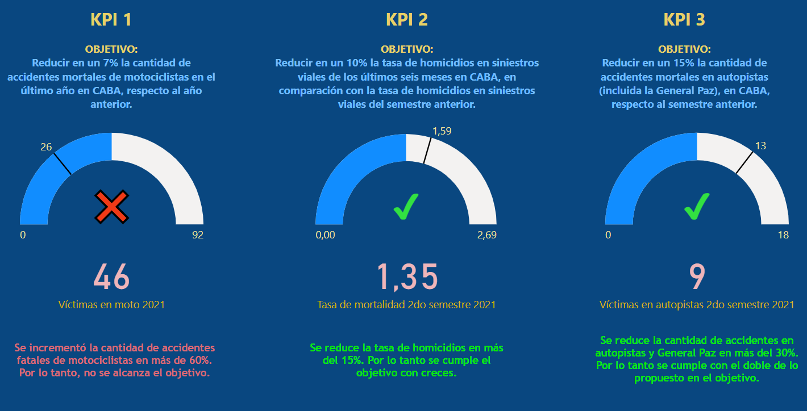

# <h1 align=center> **Proyecto Final individual #2** </h1>

# <h1 align=center> **Data Analyst sobre Análisis de Siniestros Viales en la Ciudad de Buenos Aires 2016-2021** </h1>

 

## DESCRIPCION DEL PROYECTO

El objetivo de este proyecto es analizar los accidentes de tráfico en la Ciudad de Buenos Aires utilizando datos recopilados por el Observatorio de Movilidad y Seguridad Vial (OMySV) entre 2016 y 2021. El análisis busca identificar patrones, tendencias y factores de riesgo relacionados con estos accidentes, con el propósito de proporcionar información útil para la toma de decisiones por parte de las autoridades locales y para la prevención de futuros incidentes.

Sin embargo, es importante tener en cuenta una particularidad significativa: aunque el censo de 2022 del Gobierno Argentino reporta una población estable de 3,121,707 habitantes en la Ciudad Autónoma de Buenos Aires, aproximadamente 3.5 millones de personas ingresan diariamente desde los municipios del Gran Buenos Aires. Esta diferencia tan significativa hace que cualquier cálculo de indicadores clave de rendimiento (KPIs) basado únicamente en datos del censo resulte inexacto y poco representativo de la situación real.

### Metodología y fuentes de información para las estadísticas de siniestros viales
El Observatorio de Movilidad y Seguridad Vial de la Ciudad de Buenos Aires (OMSV) toma como su principal fuente de información datos policiales, tal y como recomiendan los estándares internacionales. Las estadísticas elaboradas se realizan en base a los sumarios que instruye la Policía de la Ciudad ante dos clases de delitos que involucran la seguridad vial: lesiones culposas y homicidios culposos.

La cifra de víctimas fatales informada por el MJyS es cotejada y validada por el Observatorio, que también se nutre de la información proporcionada por múltiples áreas (SAME, AUSA, AUSOL, Hospitales Agudos de la Ciudad de Buenos Aires, medios de comunicación, la Cámara Nacional de Apelaciones, el Ministerio Público Fiscal de la Ciudad de Buenos Aires, entre otros). Esto permite que el registro sea lo más completo posible.

Vigilancia de lesionados por siniestros viales en el sistema de salud público de la Ciudad
Por otro lado, el equipo del Observatorio de Movilidad y Seguridad Vial realiza de manera primaria un seguimiento de los ingresos de pacientes por siniestros viales a los trece hospitales de agudos de la Ciudad de Buenos Aires. Dicho relevamiento actúa como fuente para la consolidación de datos de siniestralidad de fuente policial pero a su vez sirve de base para informes relativos a la atención sanitaria de las víctimas por siniestros viales atendidas en las instituciones públicas de la Ciudad.

 

## CONTENIDO DEL REPOSITORIO

- Carpeta datasets: contiene los archivos originales (xlsx) sin modificación que se usaron en el proyecto, y los csv limpios
- Carpeta imágenes: contiene imágenes para mostrar en este readme.md
- Carpeta mapa: contiene los shp utilizados en el EDA para construir el mapa de la ciudad de Buenos Aires
- Archivo Dashboard.pbix:  Dashboard Power BI con gráficos y filtros interactivos para comunicar mejor el análisis de datos
- Archivo ETL.ipynb: donde se realizaron los trabajos de limpieza de los datasets originales (incluido el trabajo sobre nulos y duplicados)
- Archivo EDA.ipynb: se realiza un análisis con distintas herramientas de Python sobre los datasets limpios mostrando toda clase de gráficos y conclusiones
- Archivo README.md: Este archivo

 

## TECNOLOGIAS Y HERRAMIENTAS UTILIZADAS

Para el desarrollo del EDA (*Exploratory Data Analysis*), se utilizaron las siguientes herramientas y tecnologias:

Para el desarrollo del dashboard, se utilizaron las siguientes herramientas:

 

## REPORTE DEL ANALISIS

El informe para el período de 6 años, desde 2016 al 2021 (incluído) cuenta con un registro total de 717 víctimas fatales por siniestros viales dentro de los 30 días del incidente, de acuerdo a la definición internacional de fallecidos como consecuencia de siniestros viales (hasta 2021, los informes se habían realizado con el dato de víctimas fatales dentro de los 7 días después de ocurrido el hecho, con la aplicación de una fórmula que estimaba el número a 30 días).

Se puede destacar que desde el año 2019 se ha logrado una reducción considerable de siniestros viales. A pesar del año atípico 2020 debido a la pandemia, este gráfico muestra que la tendencia a la baja se mantiene desde el retorno a la normalidad.

### Horarios por fines de semana (sábados y domingos)

### Horarios por días de semana (de lunes a viernes)

 

En cuanto a los picos horarios, si tomamos solo los fines de semana, observamos que se concentra entre las 5 y 7 de la mañana. Y los días de semana, tiene una distribución más uniforme en horario diurno, sin seguir un patrón preciso pero cierto pico en el horario de tarde puede observarse (despues de las 17). Las comunas más afectadas son la 1, 4 y 9, pero si tomamos solo los fines de semana, la comuna 8 tiene el mayor índice de víctimas por siniestros viales.

 

### Víctimas por edades

En cuanto a las edades, como se observa facilmente en el gráfico de abajo, se concentra en gran medida entre los 18 y 35 años de edad. Esto cambia para el sexo femenino, que se concentra en edades superiores a los 65 años de edad.

 

### Vehículo de la víctima y del acusado

 

 

Podemos observar que las principales víctimas o eran peatones, o conducían moto o auto. Y los acusados, principalmente eran autos, camiones de carga y colectivos de pasajeros.

#### PRINCIPALES VICTIMAS Y SUS ACUSADOS

- **PEATONES** víctimas por impacto contra **COLECTIVOS**: 105 
- **PEATONES** víctimas por impacto contra **AUTOS: 77**

- **MOTOS** víctimas por colisión con **AUTOS**: 83 
- **MOTOS** víctimas por colisión con **CAMIONES**: 78

 

### MAPA INDICANDO LOS PUNTOS (LATITUD-LONGITUD) DE LOS SINIESTROS EN EL PERIODO 2016 - 2021

 

## KPI

Se plantearon tres objetivos en relación a la disminución de la cantidad de víctimas fatales de los siniestros viales, desde los cuales se proponen tres indicadores de rendimiento clave o KPI.

1. Reducir en un 10% la tasa de homicidios en siniestros viales de los últimos seis meses, en CABA, en comparación con la tasa de homicidios en siniestros viales del semestre anterior*

    Las tasas de mortalidad relacionadas con siniestros viales suelen ser un indicador crítico de la seguridad vial en una región. Se define como **Tasa de homicidios en siniestros viales** al número de víctimas fatales en accidentes de tránsito por cada 100,000 habitantes en un área geográfica durante un período de tiempo específico, en este caso se toman 6 meses. Su fórmula es:

    $\text{Tasa de homicidios en siniestros viales} = \frac{\text{Número de homicidios en siniestros viales}}{\text{Población total}}·100,000$

    Como *Población Total* se calculó la población para el año 2021 a partir de los censos poblacionales del año 2010 y 2022.

    Se reduce la tasa de homicidios para el segundo semestre del año 2021 en más del 15%. Por lo tanto se cumple el objetivo con creces, al obtener una tasa de homocidios de 1.35 en comparación con el valor objetivo de 1.59 que representa una reducción del 10% con respecto al primer semestre.

 
  

2. Reducir en un 7% la cantidad de accidentes mortales de motociclistas en el último año, en CABA, respecto al año anterior*

    Para ello se define a la **Cantidad de accidentes mortales de motociclistas** como el número absoluto de accidentes fatales en los que estuvieron involucradas víctimas que viajaban en moto en un determinado periodo anual. La fórmula para medir la evolución de los accidentes mortales con víctimas en moto es:  
    
    $\text{Cantidad de accidentes mortales de motociclistas} = -\frac{\text{Víctimas moto año anterior - Víctimas moto año actual}}{\text{Víctimas moto año anterior}}·100$

    Donde:
    - $\text{Víctimas moto año anterior}$: Número de accidentes mortales con víctimas en moto en el año anterior
    - $\text{Víctimas moto año actual}$: Número de accidentes mortales con víctimas en moto en el año actual 

    Para este caso, se toma como año actual al año 2021 y como año anterior al año 2020. En primer lugar, se calculó la *Cantidad de accidentes mortales de motociclistas* para el año 2020, de esta manera el objetivo a cumplir es de **26** (es decir, la reducción del 7% de la cantidad de accidentes para 2021). Al calcular la *Cantidad de accidentes mortales de motociclistas* para el año 2021 resultó de **46** lo que significa que aumentó un 70% la cantidad de muertes de conductores de motociclistas respecto del 2021.

 
  
3. Reducir en un 15% la cantidad de accidentes mortales en autopistas (incluida la General Paz), en CABA, respecto al semestre anterior.

    Basándome en el objetivo del Plan de Seguridad Vial trabajado, que era reducir en un 30% los homicidios a causa de sinientros viales, decido llevar este objetivo pero trabajarlo para los peatones con el rango de fechas disponible en el dataset, por esta razón comparo los valores entre diciembre 2021 y diciembre 2016. Su fórmula es:  
    
    $\text{Reducción Tasa Mortalidad Peatones 2016-2021} = \frac{\text{Tasa Mortalidad Peatones 2016 - Tasa Mortalidad Peatones 2021}}{\text{Tasa Mortalidad Peatones 2016}}$

En la siguiente imagen se aprecian los rendimientos de los tres KPI propuestos.

 

 
 

## AUTOR

Lic. Leandro Funes