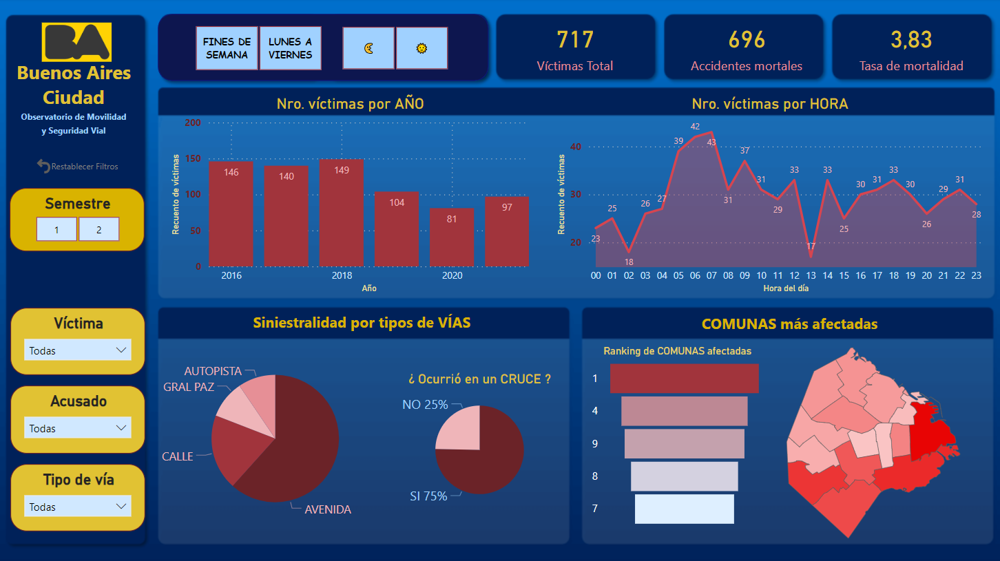

# <h1 align=center> **Proyecto Final individual #2** </h1>

# <h1 align=center> **Análisis de Siniestros Viales en la Ciudad de Buenos Aires 2016-2021** </h1>

 

## DESCRIPCION DEL PROYECTO

El objetivo de este proyecto es analizar los accidentes de tráfico en la Ciudad de Buenos Aires utilizando datos recopilados por el Observatorio de Movilidad y Seguridad Vial (OMySV) entre 2016 y 2021. El análisis busca identificar patrones, tendencias y factores de riesgo relacionados con estos accidentes, con el propósito de proporcionar información útil para la toma de decisiones por parte de las autoridades locales y para la prevención de futuros incidentes.

### Metodología y fuentes de información para las estadísticas de siniestros viales
El Observatorio de Movilidad y Seguridad Vial de la Ciudad de Buenos Aires (OMSV) toma como su principal fuente de información datos policiales, tal y como recomiendan los estándares internacionales. Las estadísticas elaboradas se realizan en base a los sumarios que instruye la Policía de la Ciudad ante dos clases de delitos que involucran la seguridad vial: lesiones culposas y homicidios culposos.

La cifra de víctimas fatales informada por el MJyS es cotejada y validada por el Observatorio, que también se nutre de la información proporcionada por múltiples áreas (SAME, AUSA, AUSOL, Hospitales Agudos de la Ciudad de Buenos Aires, medios de comunicación, la Cámara Nacional de Apelaciones, el Ministerio Público Fiscal de la Ciudad de Buenos Aires, entre otros). Esto permite que el registro sea lo más completo posible.

Vigilancia de lesionados por siniestros viales en el sistema de salud público de la Ciudad
Por otro lado, el equipo del Observatorio de Movilidad y Seguridad Vial realiza de manera primaria un seguimiento de los ingresos de pacientes por siniestros viales a los trece hospitales de agudos de la Ciudad de Buenos Aires. Dicho relevamiento actúa como fuente para la consolidación de datos de siniestralidad de fuente policial pero a su vez sirve de base para informes relativos a la atención sanitaria de las víctimas por siniestros viales atendidas en las instituciones públicas de la Ciudad.

 

## CONTENIDO DEL REPOSITORIO

- Carpeta datasets: contiene los archivos originales (xlsx) sin modificación que se usaron en el proyecto, y los csv limpios
- Carpeta imágenes: contiene imágenes para mostrar en este readme.md
- Carpeta mapa: contiene los shp utilizados en el EDA para construir el mapa de la ciudad de Buenos Aires
- Archivo Dashboard.pbix:  Dashboard Power BI con gráficos y filtros interactivos para comunicar mejor el análisis de datos
- Archivo ETL.ipynb: donde se realizaron los trabajos de limpieza de los datasets originales (incluido el trabajo sobre nulos y duplicados)
- Archivo EDA.ipynb: se realiza un análisis con distintas herramientas de Python sobre los datasets limpios mostrando toda clase de gráficos y conclusiones
- Archivo README.md: Este archivo

 

## TECNOLOGIAS Y HERRAMIENTAS UTILIZADAS

Para el desarrollo del EDA (*Exploratory Data Analysis*), se utilizaron las siguientes herramientas y tecnologias:

Para el desarrollo del dashboard, se utilizaron las siguientes herramientas:

 

## **KPI**: INDICADORES CLAVES DE RENDIMIENTO ESTABLECIDOS

Se plantearon tres objetivos en relación a la disminución de la cantidad de víctimas fatales de los siniestros viales, desde los cuales se proponen tres indicadores de rendimiento clave o KPI.

 

 

### KPI 1

Reducir en un 10% la tasa de homicidios en siniestros viales de los últimos seis meses, en CABA, en comparación con la tasa de homicidios en siniestros viales del semestre anterior*

Definimos a la tasa de homicidios en siniestros viales como el número de víctimas fatales en accidentes de tránsito por cada 100 mil habitantes en un área geográfica durante un período de tiempo específico. Su fórmula es:

$ \frac{\text{Número de homicidios en siniestros viales}}{\text{Población total}}·100,000$

Y la fórmula para conocer la evolución de la tasa de homicidios por semestre de siniestros viales en CABA es:

$ \frac{\text{Tasa de homicidios semestre anterior - Tasa de homicidios semestre actual}}{\text{Tasa de homicidios semestre anterior}}·100$

Como *Población Total* se calculó la población para el año 2021 a partir del censo poblacional del año 2022 (3.121.707 habitantes).
También es posible

 
RESULTADO SEGUNDO SEMESTRE 2021: 15% -- OBJETIVO ALCANZADO.. 
En el segundo semestre del año 2021 se alcanzó el objetivo. Se reduce la tasa de homicidios en más del 15% con respecto al primer semestre del año 2021. Al obtener una tasa de homocidios de 1.35 en comparación con el valor objetivo de 1.59.

 

### KPI 2

Reducir en un 7% la cantidad de accidentes mortales de motociclistas en el último año, en CABA, respecto al año anterior

Para ello se define a la **Cantidad de accidentes mortales de motociclistas en siniestros viales** como el número absoluto de hechos que involucran víctimas motociclistas que sufrieron accidentes fatales durante un período anual. La fórmula para medir la evolución de la cantidad de accidentes mortales en CABA por períodos anuales es:

$ \frac{\text{Accidentes moto año anterior - Accidentes moto año actual}}{\text{Accidentes moto año anterior}}·100$

* **Accidentes moto año anterior**: Número de accidentes mortales con víctimas en moto del año anterior
* **Accidentes moto año actual**: Número de accidentes mortales con víctimas en moto en el año actual

 
RESULTADO AÑO 2021: -70% -- OBJETIVO NO LOGRADO.. 
Para el año 2021 no se alcanzaron los objetivos. Por el contrario, se incrementó la cantidad de accidentes fatales de motociclistas en un 70%. El objetivo era alcanzar una cifra inferior a 25 accidentes mortales de motociclistas, pero la misma fue de 46. Sin embargo, si consideramos que fue el año atípico por la pandemia, podemos tomar como referencia el año 2019 para valorar mejor la posible reducción. En tal caso, sí observamos que se alcanza el objetivo, ya que se logra reducir un 8%.
    

 

### KPI 3

Reducir en un 15% la cantidad de accidentes mortales en autopistas (incluida la General Paz), en CABA, respecto al semestre anterior.

Se trabaja con el valor absoluto de accidentes mortales en autopistas para un período semestral. La fórmula para medir la evolución de la cantidad de accidentes mortales en autopistas durante períodos semestrales es la siguiente: 

$\frac{\text{Accidentes autopistas semestre anterior - Accidentes autopistas semestre actual}}{\text{Accidentes autopistas semestre anterior}}·100$ 

* **Accidentes autopistas semestre anterior**:  Cantidad de accidentes mortales en autopistas semestre anterior
* **Accidentes autopistas semestre actual**: Cantidad de accidentes mortales en autopistas semestre actual

 
RESULTADO SEEGUNDO SEMESTRE AÑO 2021: 30% -- OBJETIVO ALCANZADO.. 
Se supera el objetivo para el segundo semestre del año 2021. Se reduce la cantidad de accidentes en autopistas y General Paz en más del 30% para el segundo semestre del año 2021.

 
 

## DASHBOARD

Se puede interactuar a través de las páginas del dashboard para estudiar las distintas correlaciones entre las variables de todos los datos recogidos y suministrados por el Observatorio de Movilidad y Seguridad Vial de la Ciudad Autónoma de Buenos Aires, el cual puede descargarse en este mismo repositorio, y abajo puede ver las mismas:
 

  

  

  

## REPORTE DEL ANALISIS

El informe para el período de 6 años, desde 2016 al 2021 (incluído) cuenta con un registro total de 717 víctimas fatales por siniestros viales dentro de los 30 días del incidente, de acuerdo a la definición internacional de fallecidos como consecuencia de siniestros viales (hasta 2021, los informes se habían realizado con el dato de víctimas fatales dentro de los 7 días después de ocurrido el hecho, con la aplicación de una fórmula que estimaba el número a 30 días).

Se puede destacar que desde el año 2019 se ha logrado una reducción considerable de siniestros viales. A pesar del año atípico 2020 debido a la pandemia, este gráfico muestra que la tendencia a la baja se mantiene desde el retorno a la normalidad.

### Horarios por fines de semana (sábados y domingos)

### Horarios por días de semana (de lunes a viernes)

 

En cuanto a los picos horarios, si tomamos solo los fines de semana, observamos que se concentra entre las 5 y 7 de la mañana. Y los días de semana, tiene una distribución más uniforme en horario diurno, sin seguir un patrón preciso pero cierto pico en el horario de tarde puede observarse (despues de las 17). Las comunas más afectadas son la 1, 4 y 9, pero si tomamos solo los fines de semana, la comuna 8 tiene el mayor índice de víctimas por siniestros viales.

 

### Víctimas por edades

En cuanto a las edades, como se observa facilmente en el gráfico de abajo, se concentra en gran medida entre los 18 y 35 años de edad. Esto cambia para el sexo femenino, que se concentra en edades superiores a los 65 años de edad.

 

### Vehículo de la víctima y del acusado

 

 

Podemos observar que las principales víctimas o eran peatones, o conducían moto o auto. Y los acusados, principalmente eran autos, camiones de carga y colectivos de pasajeros.

#### PRINCIPALES VICTIMAS Y SUS ACUSADOS

- **PEATONES** víctimas por impacto contra **COLECTIVOS**: 105 
- **PEATONES** víctimas por impacto contra **AUTOS: 77**

- **MOTOS** víctimas por colisión con **AUTOS**: 83 
- **MOTOS** víctimas por colisión con **CAMIONES**: 78

 

### MAPA INDICANDO LOS PUNTOS (LATITUD-LONGITUD) DE LOS SINIESTROS EN EL PERIODO 2016 - 2021

 

 

## CONCLUSIONES

#### Con respecto a los objetivos planteados en los tres indicadores de logro o KPI's:
Se lograron cumplir los objetivos propuestos en los indicadores de logro semestrales KPI 1 y KPI 3, pero en cuanto al indicador anual KPI 2, no se lograron los objetivos (sin embargo, si consideramos que el año 2020 fue atípico por la pandemia, razón por la cual elegimos medir el KPI 2 contra el año 2019, podemos evidenciar que se cumplieron con todos los objetivos propuestos).

#### Patrones temporales y espaciales:
* La mayoría de los siniestros fatales ocurren durante la semana (de lunes a viernes) en horario diurno, pero se destaca un pico elevado los fines de semana entre las 5 y 7 de la madrugada.
* Las avenidas, especialmente en sus cruces, concentran el mayor porcentaje de siniestros fatales. La Avenida General Paz (con más de 60 víctimas) y las avenidas Rivadavia y Libertador (con 20 y 19 víctimas respectivamente) son las más afectadas.
* Las tres autopistas más afectadas fueron Arturo Frondizi, Perito Moreno y 25 de Mayo, que registran la mayor cantidad de víctimas fatales en este tipo de vías.
* La Comuna 1 concentra la mayoría de los siniestros con peatones atropellados por colectivos, mientras que las Comunas 4, 9, 8 y 12 se destacan por la cantidad de accidentes en autopistas y la General Paz, sobre todo motociclistas víctimas por colisionar principalmente con camiones y autos.

#### Perfiles de las víctimas y acusados:
* El perfil más común de las víctimas es de sexo masculino (casi el 80%) motociclistas, en el rol de conductor, entre 18 y 35 años de edad, luego siguen peatones concentrando el mayor rango etáreo a mayores de 65 años. Si analizamos solo por sexo femenino, nos encontramos que el rol que cumplía la víctima era peatón o acompañante-pasajera (un 80%), y por rango etáreo se concentra en las mujeres mayores de 65 años.
* El perfil de los acusados no es posible construirlo con precisión, ya que solo se cuenta con el tipo de vehículo que conducían, siendo los principales colectivos de pasajeros (sobre todo en la comuna 1) y camiones (en General Paz y autopistas), lo cual permite inferir que una gran mayoría son choferes con licencia profesional en muchos casos (pero es necesario realizar otra investigación al respecto).
 

 
 

## AUTOR

Lic. Leandro Funes